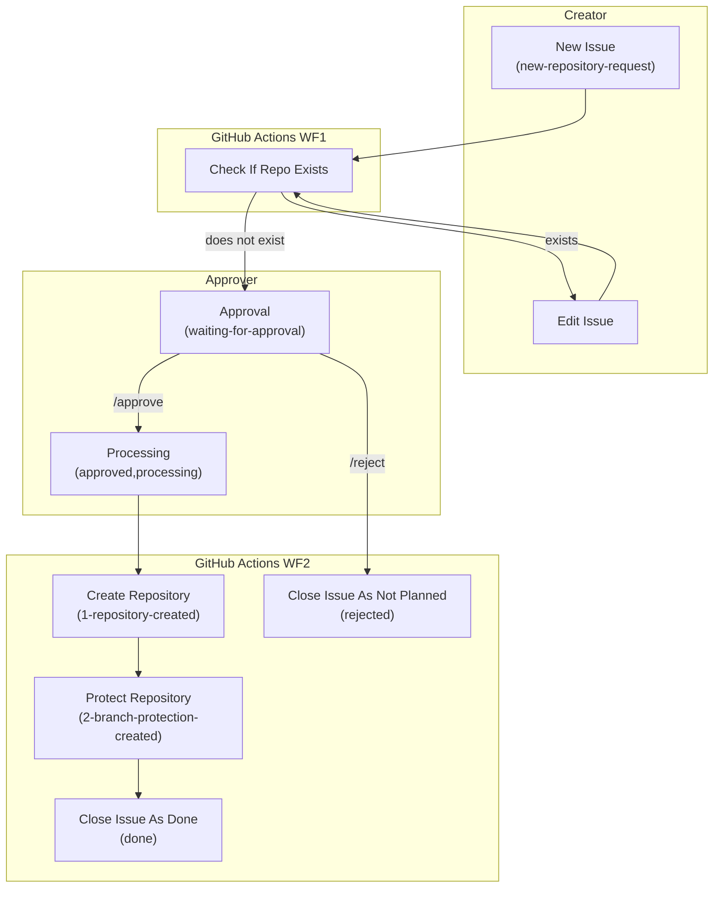

# bootstrap

This bootstrap repo is a demonstration of how to use Issues and GitHub Actions to create a process for managing and governing repository creation.

## Flow diagram

```mermaid
graph TD
  subgraph Creator
    NewIssue["New Issue<br>(new-repository-request)"]
    EditIssue["Edit Issue"]
  end

  subgraph Approver
    Approval["Approval<br>(waiting-for-approval)"]
    Processing["Processing<br>(approved,processing)"]
  end

  subgraph GitHub Actions WF1
    NewIssue --> CheckIfRepoExists["Check If Repo Exists"]
  end

  subgraph GitHub Actions WF2
    CheckIfRepoExists -->|does not exist| Approval
    CheckIfRepoExists -->|exists| EditIssue
    EditIssue --> CheckIfRepoExists
    Approval -->|/approve| Processing
    Processing -->CreateRepo["Create Repository<br/>(1-repository-created)"]
    Approval -->|/reject| CloseIssueAsNotPlanned["Close Issue As Not Planned<br>(rejected)"]
    CreateRepo --> ProtectRepo["Protect Repository<br/>(2-branch-protection-created)"]
    ProtectRepo --> CloseIssueAsDone["Close Issue As Done<br>(done)"]
  end
```